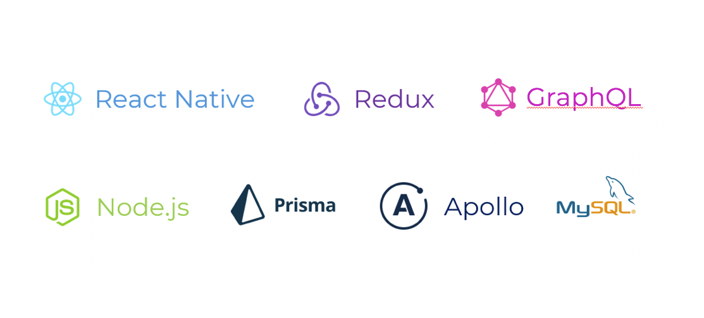

# Loika

Loika is an ecommerce/subscription-based application that aims to deliver the best quality produces from the local farmers at a fair price to the consumers’ doorstep with ease and reliability. 

## How it works

The application is designed on the mobile phone aimed to connect the customers and our service. It is designed with to attract the customers and also for easy transactions and users’ experience. The customers can choose, schedule their choices so the experience can be tailored to each customer. 
The application helps the customers to keep track of their products, discover new offers and options or learn more about the origin of the produces. Thus, the engagement of the application is crucial to the business, it is how we communicate and promote the products to our customers. 

## Inspiration
Loika took inspiration from the modern trend of food produces. There has been a dramatic demand in locally, ecological produced food supply for everyday need as an average consumer is more conscious about the ingredients on their plates and its origins. Thanks to the internet, people are increasingly gaining awareness about the packaged overly process food and the pressure it brings to the health of the consumer in the long time, as well as the environment. It is only natural people are yearning for quality foods that they can rely on fully while relieve the amount of waste produced by industrial factories and the national scale transportation.

## Technology Stack

## Demo

## How to run the project

### Frontend
First of all, run `cd front-end/` in your Terminal, then do the steps below:

1. Run `npm install` to install dependencies
2. Run `npm start` to start the server, please keep it running
3. On the opened webpage, change to "Tunnel" then scan the QR code on your phone
4. Start developing and see the changes automatically appear on your phone

Note: Due to the lack of time, the application works best on Iphone 6s Plus

### Backend

First of all, run `cd back-end/`in your Terminal, then do the steps below:

1. Run `npm install` to install dependencies
2. Run `npm run dev` to start the server, please keep it running
3. Open your website at `localhost:4444` to use the Graphql Yoga playground.

The Graphql Playground is live at https://loika-yoga-prod.herokuapp.com/
